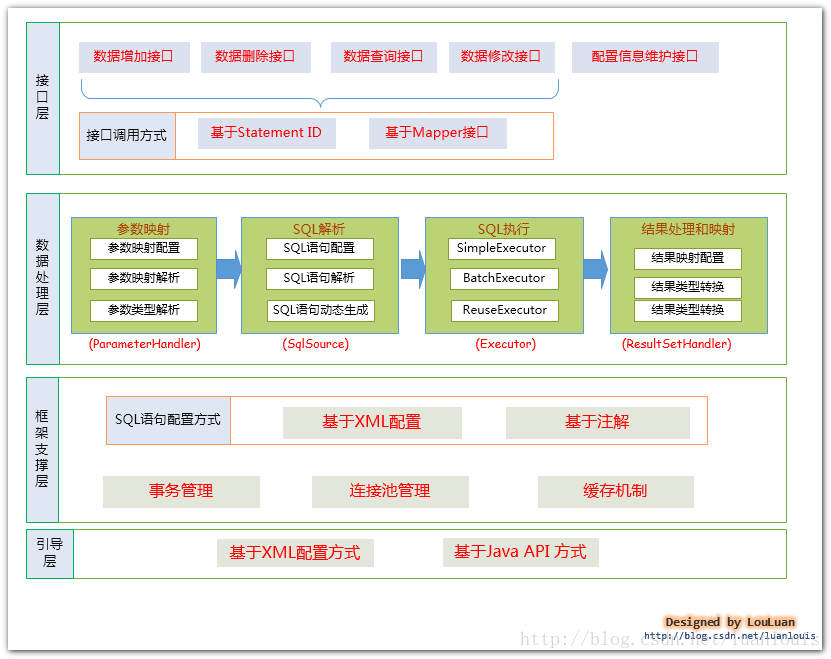
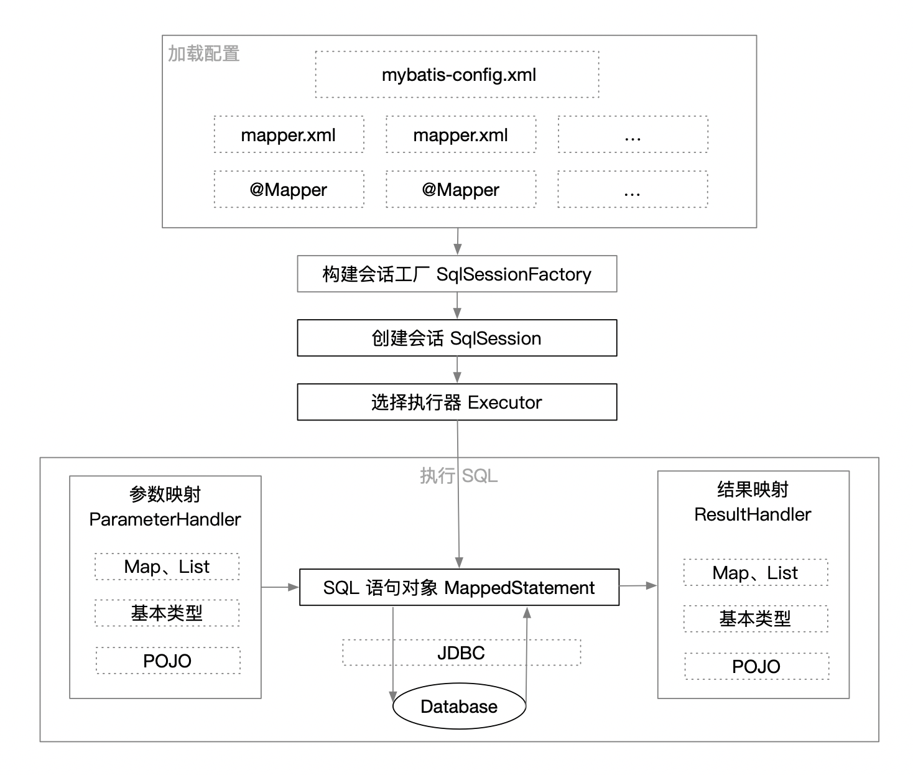
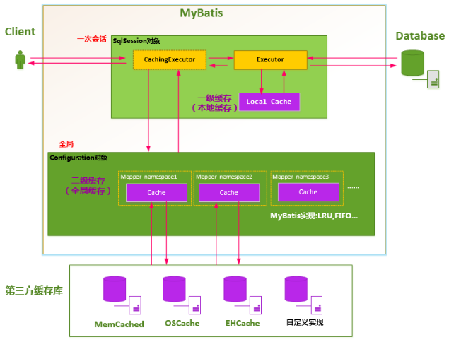

# MyBatis

MyBatis 是一个 Java 持久层框架，通过XML文件或注解把对象与SQL语句关联起来，内部封装了JDBC操作数据库的过程。	

MyBatis 框架体系示意图：

## 核心部件

- **SqlSession** 作为MyBatis工作的主要顶层API，表示与数据库交互的会话，完成数据库增删改查功能
- **Executor** MyBatis执行器，是MyBatis 调度的核心，负责执行SQL语句和维护查询缓存（一级缓存）
- **StatementHandler**  封装了 JDBC Statement 操作，如设置参数、执行SQL、返回执行结果。
- **ParameterHandler**  负责将用户传递的参数转换成 JDBC Statement 所需要的参数，
- **ResultHandler**  负责转换 JDBC ResultSet 结果集；
- **TypeHandler** 负责 Java 数据类型和 JDBC 数据类型之间的映射和转换
- **MappedStatement**  维护了一条 `<select|update|delete|insert>` 节点的封装，
- **SqlSource** 负责根据用户传递的parameterObject，解析动态SQL语句，将信息封装到BoundSql对象中
- **BoundSql** 维护解析后的SQL语句以及相应的参数信息
- **Configuration** MyBatis所有的配置信息都维持在Configuration对象之中。

## 工作流程

MyBatis的工作原理示意图：

流程解析：

1. 初始化：解析配置文件 mybatis-config.xml，使用这些配置信息创建 Configuration 对象。将Mapper.xml 组装成一个个MappedStatement 对象
2. 构造会话工厂 SqlSessionFactory：使用 Configuration 对象中的配置信息构建会话工厂SqlSessionFactory。
3. 创建会话对象 SqlSession：由会话工厂创建SqlSession对象。用来执行SQL，管理事务。
4. 选择执行器 Executor：由SQL语句类型来创建相应的执行器。
   1. 解析SQL：使用ParameterHandler对映射器中的SQL语句中的变量进行解析替换。
5. 执行SQL:  交由JDBC来执行SQL
6. 结果映射：使用ResultHandler对查询结果进行加工，以便于调用方使用。

## 缓存机制

MyBatis 提供了两种级别的缓存，分别是会话级缓存（ Session Cache）和应用级缓存（Application Cache），简称为一级缓存和二级缓存。

### 一级缓存

MyBatis 默认开启一级缓存。在同个SqlSession中，查询语句相同的sql会被缓存，但是一旦执行新增或更新或删除操作，缓存就会被清除。

**一级缓存的底层实现**

MyBatis 使用 SqlSession 对象表示一次数据库的会话，SqlSession 将它的工作交给了 Executor 执行器这个角色来完成，负责完成对数据库的各种操作。当创建了一个 SqlSession 对象时，MyBatis 会为这个 SqlSession 对象创建一个新的 Executor 执行器，而缓存信息就被维护在这个 Executor 执行器中。Executor 接口的实现类 BaseExecutor 中拥有一个Cache 接口的实现类 PerpetualCache，则对于 BaseExecutor对象而言，它将使用 PerpetualCache 对象维护缓存。PerpetualCache 是通过一个简单的HashMap来实现的。

**一级缓存的生命周期**

​	a、MyBatis 在开启一个数据库会话时，会 创建一个新的 SqlSession 对象，SqlSession 对象中会有一个新的 Executor 对象。Executor 对象中持有一个新的 PerpetualCache 对象；当会话结束时，SqlSession 对象及其内部的 Executor 对象还有 PerpetualCache 对象也一并释放掉。

​	b、如果SqlSession调用了close()方法，会释放掉一级缓存 PerpetualCache对象，一级缓存将不可用。

​	c、如果SqlSession调用了clearCache()，会清空PerpetualCache对象中的数据，但是该对象仍可使用。

​	d、SqlSession中执行了任何一个update操作(update()、delete()、insert()) ，都会清空PerpetualCache对象的数据，但是该对象可以继续使用

**一级缓存的工作流程**

​	a、对于某个查询，根据 `statementId, params, rowBounds, boundSql`来构建一个 key 值，根据这个 key 值取出Cache 中的数据；

​	b、如果命中，则直接返回缓存结果；

​	d、如果没命中，则去数据库中查询数据，将key和查询到的结果组成`<key, value>`存储到 Cache中，将查询结果返回；

### 二级缓存

MyBatis的二级缓存是应用级别的缓存，它可以提高对数据库查询的效率，以提高应用的性能。

SqlSessionFactory 层面上的二级缓存默认是不开启的，二级缓存的开启需要进行配置，实现二级缓存的时候，MyBatis要求返回的POJO必须是可序列化的。 也就是要求实现Serializable接口，配置方法很简单，只需要在映射XML文件配置就可以开启缓存了`<cache/>`，如果我们配置了二级缓存就意味着：

- 映射语句文件中的所有 select 语句将会被缓存。
- 映射语句文件中的所有 insert、update 和 delete 语句会刷新缓存。
- 缓存会使用默认的 Least Recently Used（LRU，最近最少使用的）算法来收回。
- 根据时间表，比如 No Flush Interval,（CNFI没有刷新间隔），缓存不会以任何时间顺序来刷新。
- 缓存会存储列表集合或对象(无论查询方法返回什么)的1024个引用
- 缓存会被视为是 read/write(可读/可写)的缓存，意味着对象检索不是共享的，而且可以安全的被调用者修改，不干扰其他调用者或线程所做的潜在修改。

## 数据源机制

MyBatis把数据源DataSource分为三种：

* UNPOOLED   不使用连接池的数据源
* POOLED   使用连接池的数据源
* JNDI      使用JNDI实现的数据源

## 事务管理机制

**MyBatis的事务管理分为两种形式：**

**一、使用JDBC的事务管理机制**：即利用java.sql.Connection对象完成对事务的提交（commit()）、回滚（rollback()）、关闭（close()）等

**二、使用MANAGED的事务管理机制：**这种机制MyBatis自身不会去实现事务管理，而是让程序的容器如（JBOSS，Weblogic）来实现对事务的管理

## 插件机制

与其称为Mybatis插件，不如叫Mybatis拦截器，更加符合其功能定位，实际上它就是一个拦截器，应用代理模式，在方法级别上进行拦截。

### 支持拦截的方法

- 执行器Executor（update、query、commit、rollback等方法）；
- 参数处理器ParameterHandler（getParameterObject、setParameters方法）；
- 结果集处理器ResultSetHandler（handleResultSets、handleOutputParameters等方法）；
- SQL语法构建器StatementHandler（prepare、parameterize、batch、update、query等方法）；

https://www.cnblogs.com/chenpi/p/10498921.html

## Mybatis中使用了哪些设计模式

1、Builder模式：例如SqlSessionFactoryBuilder、XMLConfigBuilder、XMLMapperBuilder、XMLStatementBuilder、CacheBuilder

2、工厂模式：例如SqlSessionFactory、ObjectFactory、MapperProxyFactory

3、单例模式：例如LogFactory、ErrorContext

4、代理模式：mybatis实现的核心，比如MapperProxy、ConnectionLogger、用的jdk的动态代理，还有executor.loader包使用了cglib或者javassist达到延迟加载的效果

5、组合模式：例如SqlNode和各个子类ChooseSqlNode等

6、模板方法模式：例如BaseExecutor和SimpleExecutor，还有BaseTypeHandler和所有的子类例如IntegerTypeHandler

7、适配器模式：例如Log的Mybatis接口和它对jdbc、log4j等各种日志框架的适配实现

8、装饰者模式：例如Cache包中的cache.decorators子包中的各个装饰者的实现

9、迭代器模式：例如迭代器模式PropertyTokenizer

