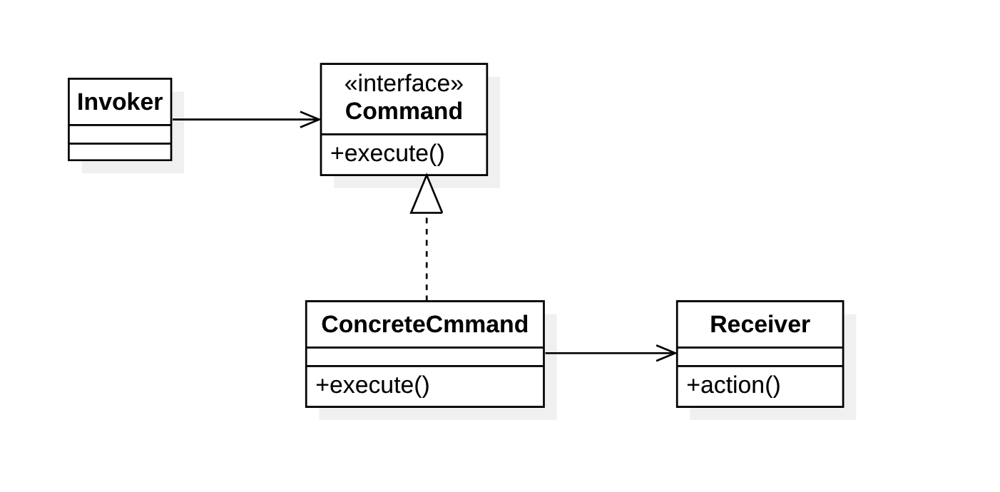
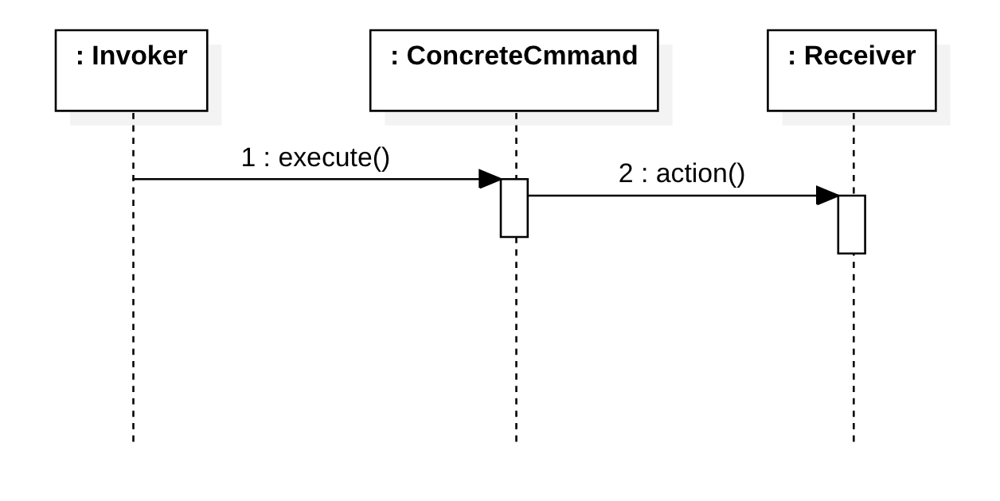

# 命令模式（Command Pattern）

## 定义

意图：**将一个请求封装为一个对象，从而使我们可用不同的请求对客户进行参数化**。

命令模式是一种对象行为型模式。

命令模式的本质是对命令进行封装，将发出命令的责任和执行命令的责任分割开。命令模式使请求本身成为一个对象，这个对象和其他对象一样可以被存储和传递。

命令模式的主要优点在于降低系统的耦合度，增加新的命令很方便，而且可以比较容易地设计一个命令队列和宏命令，并方便地实现对请求的撤销和恢复；其主要缺点在于可能会导致某些系统有过多的具体命令类。

## 结构

### 类图

### 时序图

### 角色

- 客户端（Client)：请求的发起者。

- 抽象命令（Command）：声明了用于执行请求的 execute() 等方法。
- 具体命令（ConcreteCommand）: 封装之后执行请求所需的信息，包括接收者对象及调用其方法所需的参数
- 调用者（Invoker）:  负责调用命令对象执行请求。
- 接收者（Receiver）: 负责具体实施和执行一个请求。

## 与其他模式的关联

### 适用场景

### 应用案例

- GUI按钮和菜单项
- 宏录制
- HTTP请求

## 参考

- [Command pattern](https://en.wikipedia.org/wiki/Command_pattern) - Wikipedia
- [命令模式](https://design-patterns.readthedocs.io/zh_CN/latest/behavioral_patterns/command.html#id16) - 图说设计模式
- [《JAVA与模式》之命令模式](https://www.cnblogs.com/java-my-life/archive/2012/06/01/2526972.html) - [博客园](https://www.cnblogs.com/) 

