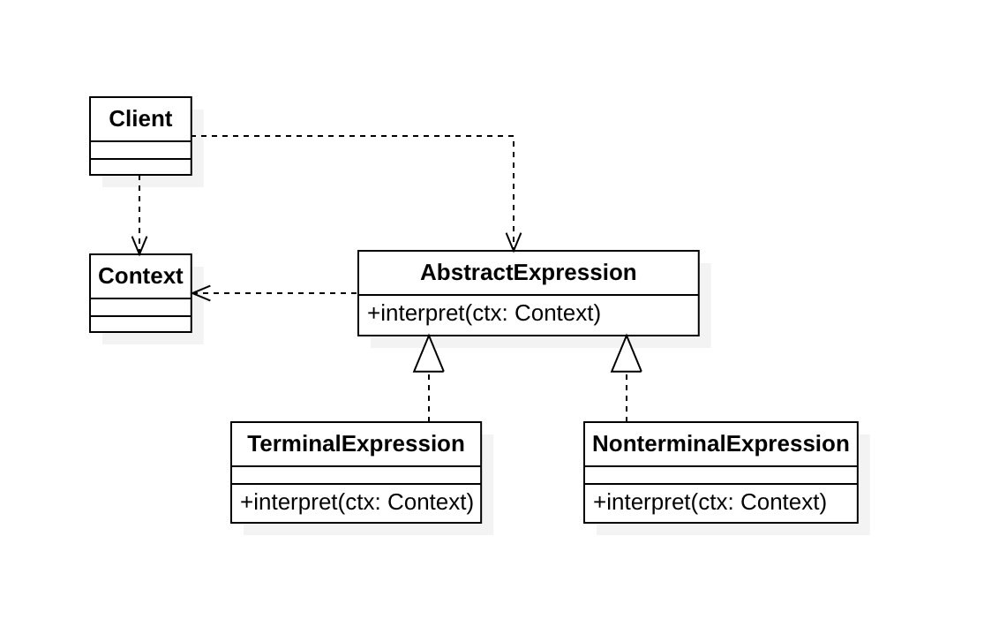
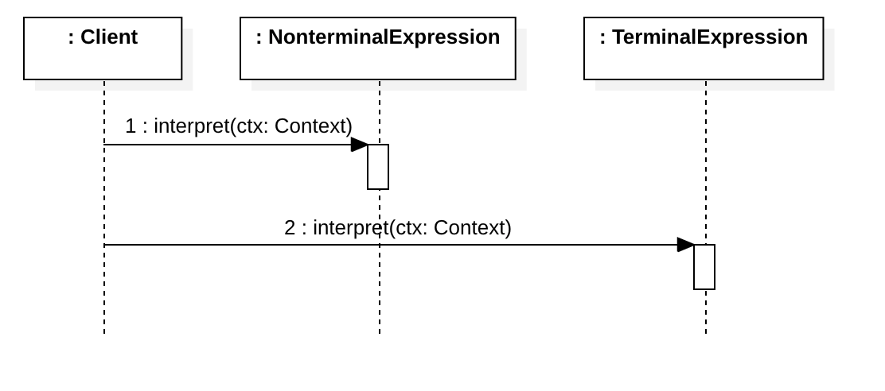

### 解释器模式（Interpreter Pattern）

## 定义

定义一个语言的文法，并且建立一个解释器来解释该语言中的句子，这里的 "语言" 是指使用规定格式和语法的代码。解释器模式是一种类行为型模式。

## 结构

### 类图

### 时序图

### 角色

- 抽象表达式（AbstractionExpression）：在抽象表达式中声明了抽象的解释操作，它是所有终结符表达式和非终结符表达式的公共父类。

- 终结符表达式（TerminalExpression）：它实现了与文法中的终结符相关联的解释操作，在句子中的每一个终结符都是该类的一个实例。通常在一个解释器模式中只有少数几个终结符表达式类，它们的实例可以通过非终结符表达式组成较为复杂的句子。

- 非终结符/连接符（NonterminalExpression）：它实现了文法中非终结符的解释操作，由于在非终结符表达式中可以包含终结符表达式，也可以继续包含非终结符表达式，因此其解释操作一般通过递归的方式来完成。

- 环境类（Context）：环境类又称为上下文类，它用于存储解释器之外的一些全局信息，通常它临时存储了需要解释的语句。

## 适用场景

## 参考

- [设计模式 | 解释器模式及典型应用](https://juejin.im/post/5c3afc586fb9a049a979f01e#heading-7) - 掘金
- 