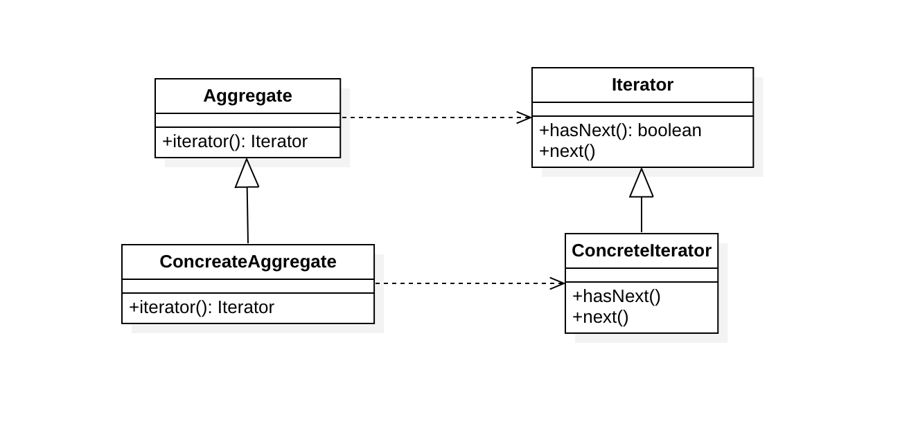

# 迭代器模式（Iterator Pattern）

## 定义

在不暴露底层实现（数据结构）的情况下，提供一个有序访问聚合对象的元素的方法。

## 结构

### 类图

### 时序图

### 角色

- 抽象迭代器（Iterator）：定义遍历聚合体中的元素所需的接口。
- 具体迭代器（ConcreteIterator）：实现迭代器接口，并保持迭代过程中的游标位置。
- 抽象聚合体（Aggregate）：定义聚合体，并提供创建迭代器的接口
- 具体聚合体（ConcreteAggregate）：实现了创建迭代器的接口，返回一个具体迭代器对象

## 适用场景

- 访问一个聚合对象的内容而无须暴露它的内部表示
- 需要为聚合对象提供多种遍历方式
- 为遍历不同的聚合结构提供一个统一的接口(支持多态迭代化)

## 参考

- [Iterator pattern](https://en.wikipedia.org/wiki/Iterator_pattern) - Wikipedia