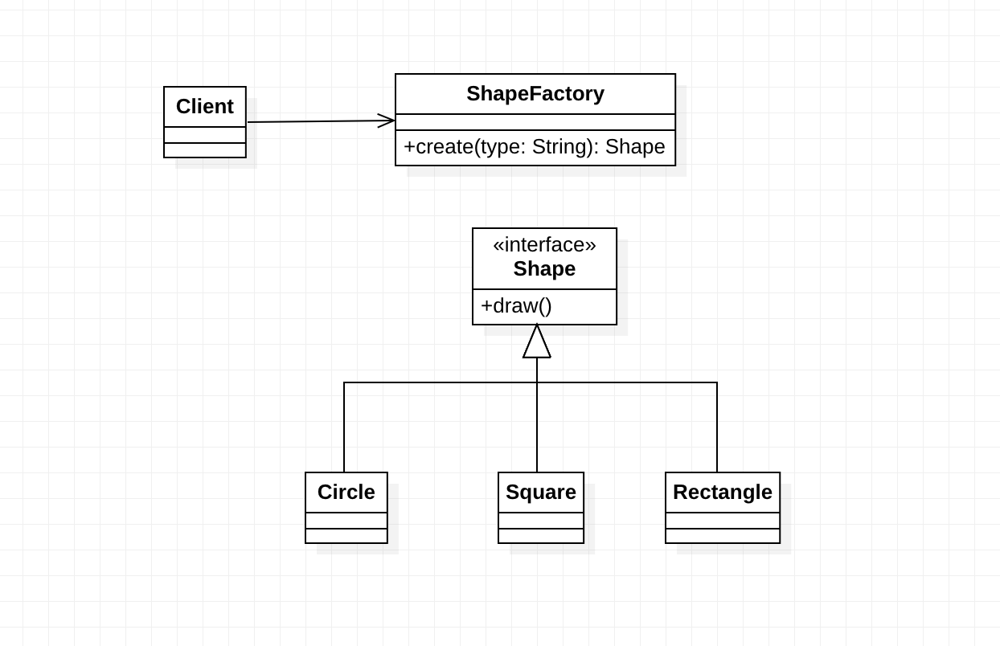

# 工厂模式（Factory Pattern)

工厂模式（Factory Pattern）是一种实现了“工厂”概念的[面向对象](https://zh.wikipedia.org/wiki/面向对象)[设计模式](https://zh.wikipedia.org/wiki/设计模式_(计算机))。就像其他[创建型模式](https://zh.wikipedia.org/wiki/創建型模式)一样，它也是处理在不指定[对象](https://zh.wikipedia.org/wiki/对象_(计算机科学))具体[类型](https://zh.wikipedia.org/wiki/类_(计算机科学))的情况下创建对象的问题。

创建一个对象常常需要复杂的过程，所以不适合包含在一个复合对象中。创建对象可能会导致大量的重复代码，可能会需要复合对象访问不到的信息，也可能提供不了足够级别的抽象，还可能并不是复合对象概念的一部分。工厂方法模式通过定义一个单独的创建对象的方法来解决这些问题。由[子类](https://zh.wikipedia.org/wiki/子类)实现这个方法来创建具体类型的对象。

## 意图

定义一个创建对象的接口，但让实现这个接口的类来决定实例化哪个类。工厂方法让类的实例化推迟到子类中进行。

## 优点

1. 一个调用者想创建一个对象，只要知道其名称就可以了。

2. 扩展性高，如果想增加产品种类，只要扩展一个工厂类就可以。

3. 屏蔽产品的具体实现，调用者只关心产品的接口。

## 缺点

1. 每次增加一个产品时，都需要增加一个具体类和对象实现工厂，使得系统中类的个数成倍增加，在一定程度上增加了系统的复杂度，同时也增加了系统具体类的依赖。这并不是什么好事。

## 实现

## 应用