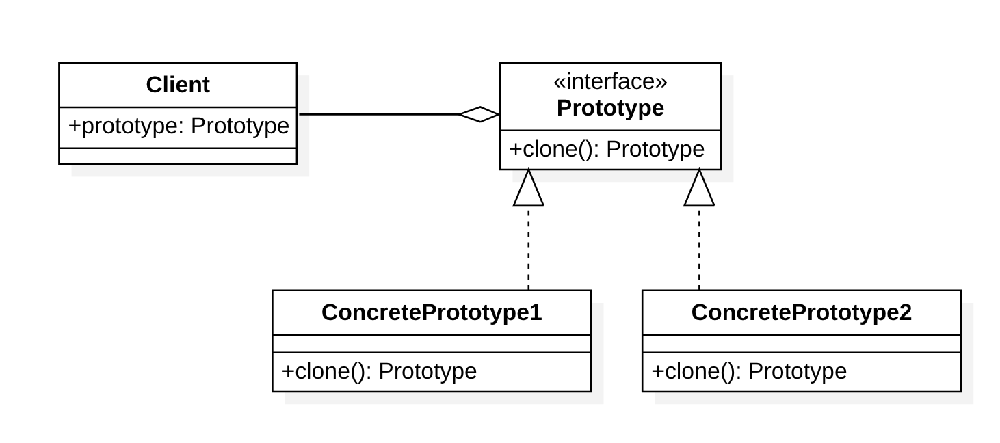
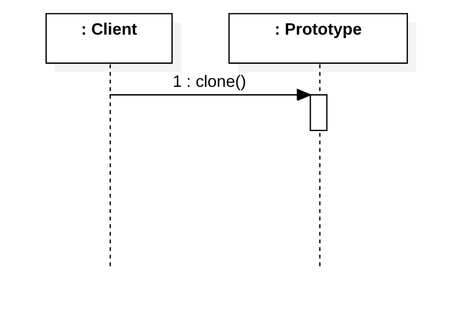

# 原型模式（Prototype Pattern)

## 定义

意图：**通过复制一个现有的对象来生成新的对象，而不是通过实例化的方式**。

原型模式（Prototype Pattern）用于创建重复的对象，同时又能保证性能。原型模式属于创建型模式。

## 结构

### 类图

### 时序图

### 角色

- **Prototype**：抽象原型
- **Concrete Prototype**：具体原型，可以被复制的对象

## 优点

1. 节省类初始化过程中消耗的资源，**提高性能**。

## 缺点

1. 配备克隆方法需要对类的功能进行通盘考虑，这对于全新的类不是很难，但对于已有的类不一定很容易，特别当一个类引用不支持序列化的间接对象，或者引用含有循环结构的时候。 
2. 必须实现 Cloneable 接口。

## 应用