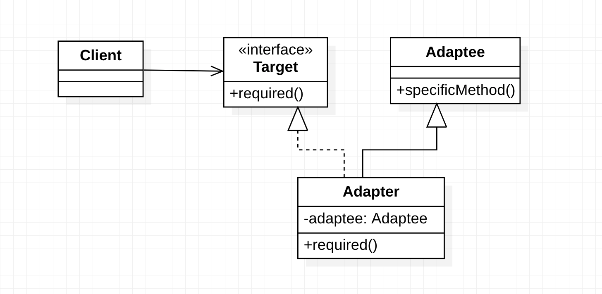
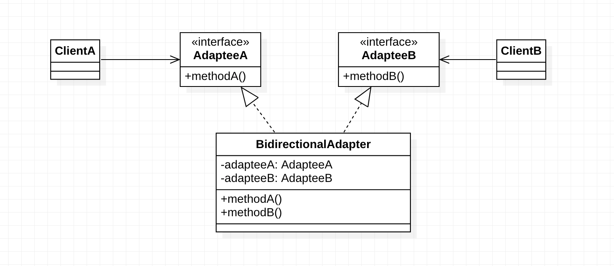

# 适配器模式(Adapter Pattern)

[TOC]

## 定义

意图：**将一个类的接口转换成客户希望的另外一个接口。适配器模式使得原本由于接口不兼容而不能一起工作的那些类可以一起工作。**

适配器模式（Adapter Pattern）是作为两个不兼容的接口之间的桥梁。这种类型的设计模式属于结构型模式，它结合了两个独立接口的功能。

这种模式涉及到一个单一的类，该类负责加入独立的或不兼容的接口功能。举个真实的例子，读卡器是作为内存卡和笔记本之间的适配器。您将内存卡插入读卡器，再将读卡器插入笔记本，这样就可以通过笔记本来读取内存卡。

## 适用场景

1. 系统需要使用现有的类，而此类的接口不符合系统的需要。
2. 想要建立一个可以重复使用的类，用于与一些彼此之间没有太大关联的一些类，包括一些可能在将来引进的类一起工作，这些源类不一定有一致的接口；
3. 通过接口转换，将一个类插入另一个类系中。（比如老虎和飞禽，现在多了一个飞虎，在不增加实体的需求下，增加一个适配器，在里面包容一个虎对象，实现飞的接口。）

## 结构

### 类图



### 角色

- Target：目标对象
- Adapter：适配器
- Adaptee：被适配者
- Client：客户类

Adapter 适配器设计模式中有 3 个重要角色：被适配者 Adaptee，适配器 Adapter 和目标对象 Target。其中两个现存的想要组合到一起的类分别是被适配者 Adaptee 和目标对象 Target 角色，按照类图所示，我们需要创建一个适配器 Adapter 将其组合在一起。

### 优点

适配器模式也是一种包装模式，它与装饰模式同样具有包装的功能，此外，对象适配器模式还具有委托的意思。总的来说，适配器模式属于补偿模式，专用来在系统后期扩展、修改时使用。

### 缺点

1. 过多的使用适配器，会让系统非常零乱，不易整体进行把握。比如，明明看到调用的是 A 接口，其实内部被适配成了 B 接口的实现，一个系统如果太多出现这种情况，无异于一场灾难。因此如果不是很有必要，可以不使用适配器，而是直接对系统进行重构。
2. 由于 JAVA 至多继承一个类，所以至多只能适配一个适配者类，而且目标类必须是抽象类。

## 应用


## 扩展

### 双向（Bidirectional）

适配器也可以实现双向的适配，前面所讲的都是把 Adaptee 适配成为 Target，其实也可以把 Target 适配成为 Adaptee。也就是适配两个Adaptee。



双向适配器同时实现了 Target 和 Adaptee 的接口，使得双向适配器可以在 Target 或 Adaptee 被使用的地方使用，以提供对所有客户的透明性。尤其在两个不同的客户需要用不同的地方查看同一个对象时，适合使用双向适配器。

在实际开发中，我们很少使用双向适配器。

## 应用案例

JDK 中使用适配器模式的案例:

```
java.util.Arrays#asList()
javax.swing.JTable(TableModel)
java.io.InputStreamReader(InputStream)
java.io.OutputStreamWriter(OutputStream)
```

Spring 中使用适配器模式的典型案例：

```

```


## 参考资料

- [适配器模式原理及实例介绍]( https://www.ibm.com/developerworks/cn/java/j-lo-adapter-pattern/index.html?ca=drs- ) - IBM Developer

- [适配器模式](https://www.runoob.com/design-pattern/adapter-pattern.html) - 菜鸟教程
