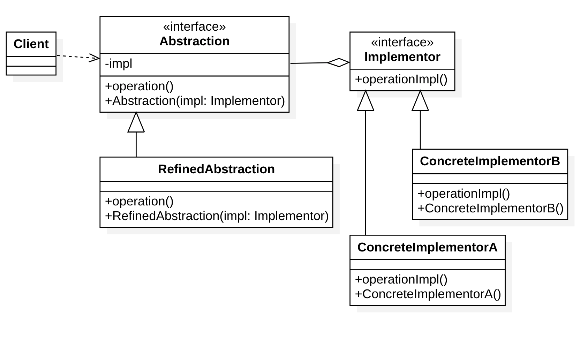

# 桥接模式（Bridge Pattern)

## 定义

意图：**将抽象部分(Abstraction)与实现部分(Implementation)分离，使它们都可以独立的变化。**

桥接模式属于结构型模式。

实现系统可能有多个角度分类，每一种角度都可能变化，那么**把这种多角度分类给分离出来让他们独立变化，减少他们之间耦合**。桥接模式中的所谓脱耦，就是指在一个软件系统的抽象化和实现化之间使用关联关系（组合或者聚合关系）而不是继承关系，从而使两者可以相对独立地变化，这就是桥接模式的用意。

桥接模式和适配器模式用于设计的不同阶段，**桥接模式用于系统的初步设计**，对于存在两个独立变化维度的类可以将其分为抽象化和实现化两个角色，使它们可以分别进行变化；而在初步设计完成之后，当发现系统与已有类无法协同工作时，可以采用适配器模式。但有时候在设计初期也需要考虑适配器模式，特别是那些涉及到大量第三方应用接口的情况。

## 结构

### 角色

- **Abstraction**：抽象类
- **RefinedAbstraction**：扩充抽象类
- **Implementor**：实现类接口
- **ConcreteImplementor**：具体实现类

### 类图

### 时序图

## 优点

- 抽象与实现分离，它们可以沿着各自的维度独立变化，便于扩展。
- 实现细节对客户透明。

## 缺点

- 桥接模式的引入会增加系统的理解与设计难度，由于聚合关联关系建立在抽象层，要求开发者针对抽象进行设计与编程。
- 桥接模式要求正确识别出系统中两个独立变化的维度，因此其使用范围具有一定的局限性。

## 应用 

## 参考

- [桥接模式](https://design-patterns.readthedocs.io/zh_CN/latest/structural_patterns/bridge.html) - https://design-patterns.readthedocs.io/
- [桥接模式](https://www.runoob.com/design-pattern/bridge-pattern.html) - 菜鸟教程

