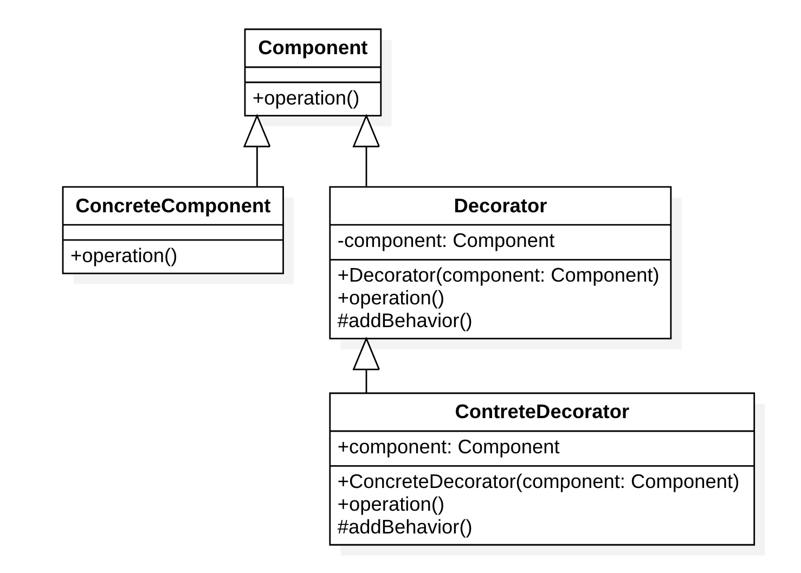
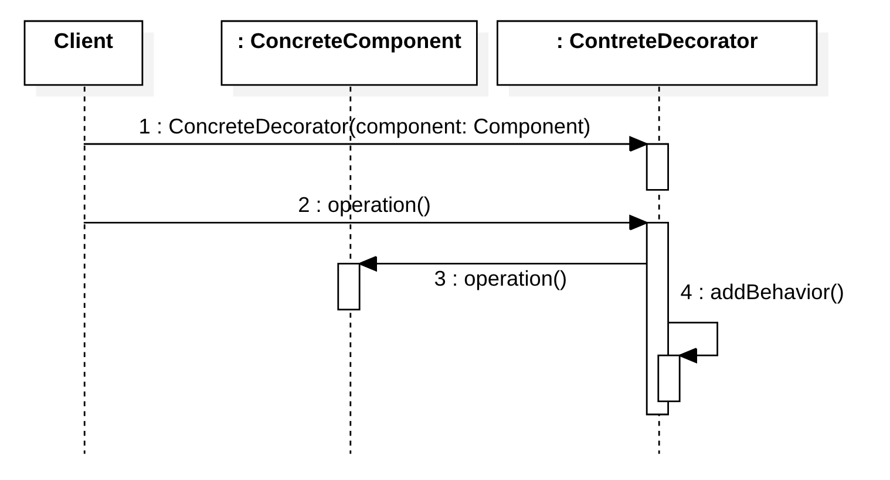

# 装饰器模式（Decorator Pattern）

## 定义

意图：动态地给一个对象添加一些额外的功能。

装饰模式属于对象结构型模式。

## 结构

### 角色

- Component：抽象构件
- ConcreteComponent: 具体构件
- Decorator: 抽象装饰类
- ConcreteDecorator: 具体装饰类

### 类图

### 时序图

## 优点

装饰模式是继承的一个替代模式，装饰模式可以动态扩展一个实现类的功能

## 缺点

多层装饰比较复杂

## 应用

Java类库中输入输出流的设计

## 参考

- [装饰模式](https://design-patterns.readthedocs.io/zh_CN/latest/structural_patterns/decorator.html) - https://design-patterns.readthedocs.io/

- [装饰器模式](https://www.runoob.com/design-pattern/decorator-pattern.html) - 菜鸟教程

