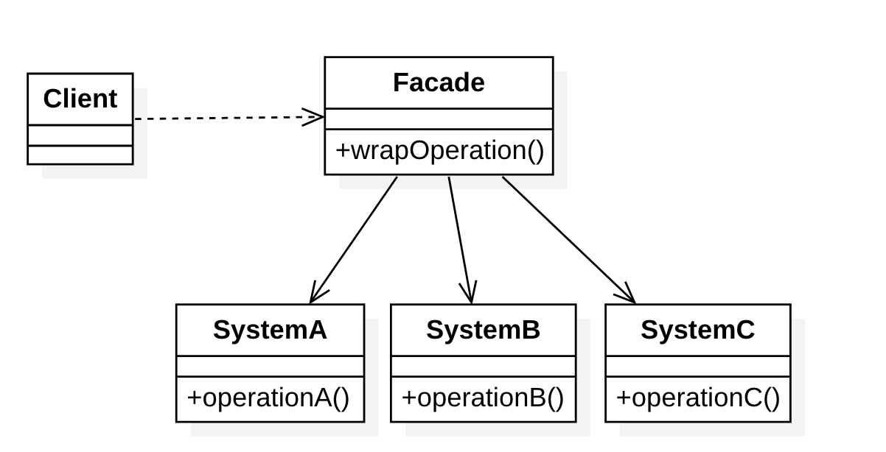
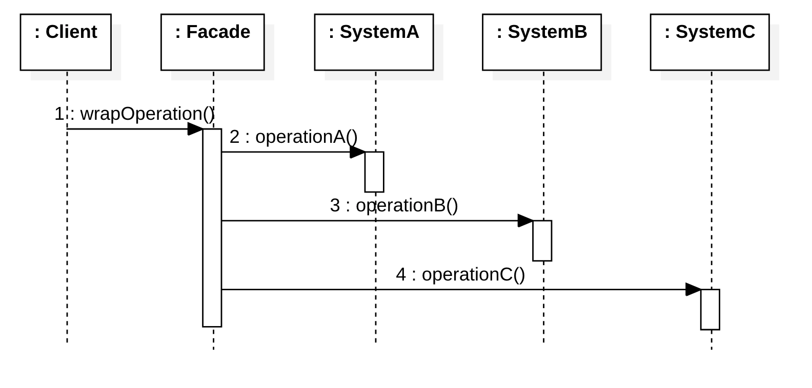

# 外观模式（Facade Pattern）

## 定义

意图：**为子系统中的一组接口提供一个统一的高层接口，使得子系统更容易使用**。

外观模式属于结构型模式。

## 结构

### 角色

- Facade: 外观角色
- SubSystem:子系统角色

### 类图

### 时序图

## 优点

- 减少系统相互依赖。
- 实现了子系统与客户之间的松耦合关系，这使得子系统的组件变化不会影响到调用它的客户类，只需要调整外观类即可。
- 只是提供了一个访问子系统的统一入口，并不影响用户直接使用子系统类

## 缺点

- 不能很好地限制客户使用子系统类，如果对客户访问子系统类做太多的限制则减少了可变性和灵活性。
- 在不引入抽象外观类的情况下，增加新的子系统可能需要修改外观类或客户端的源代码，违背了“开闭原则”。

## 应用

## 参考