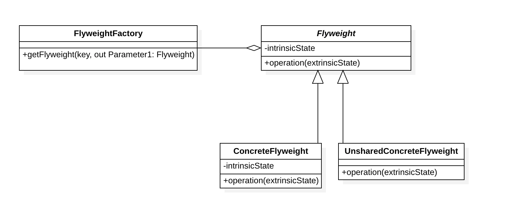
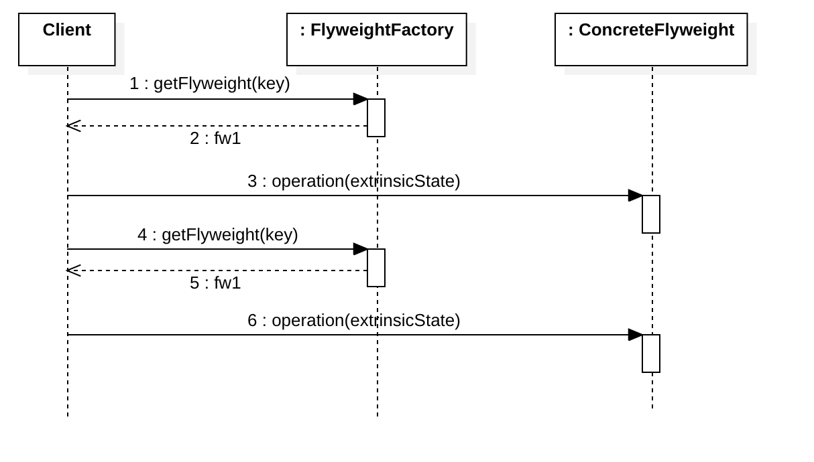

# 享元模式（Flyweight Pattern）

## 定义

意图：**运用共享技术有效地支持大量细粒度对象的复用**。

系统只使用少量的对象，而这些对象都很相似，状态变化很小，可以实现对象的多次复用。由于享元模式要求能够共享的对象必须是细粒度对象，因此它又称为轻量级模式，它是一种对象结构型模式。

为了在客户端与线程之间安全共享，享元对象必须是不可变的（immutable)。享元对象通常被定义为值对象，实例的标识无关紧要，具有相同值的享元对象被认为是相等的。

## 角色

- **Flyweight（抽象享元类）**：通常是一个接口或抽象类，在抽象享元类中声明了具体享元类公共的方法，这些方法可以向外界提供享元对象的内部状态，同时也可以通过这些方法来设置外部状态。
- **ConcreteFlyweight（具体享元类）**：它实现了抽象享元类，其实例称为享元对象；在具体享元类中为内部状态提供了存储空间。通常我们可以结合单例模式来设计具体享元类，为每一个具体享元类提供唯一的享元对象。
- **UnsharedConcreteFlyweight（非共享具体享元类）**：并不是所有的抽象享元类的子类都需要被共享，不能被共享的子类可设计为非共享具体享元类；当需要一个非共享具体享元类的对象时可以直接通过实例化创建。
- **FlyweightFactory（享元工厂类）**：用于创建并管理享元对象，它针对抽象享元类编程，将各种类型的具体享元对象存储在一个享元池中，享元池一般设计为一个存储“键值对”的集合（也可以是其他类型的集合），可以结合工厂模式进行设计；当用户请求一个具体享元对象时，首先从享元池中获取，如果享元池中不存在，则创建一个新的享元对象返回给用户，并在享元池中保存该新增对象。

> IntrinsicState（内部状态）：不会随上下文的改变而有所不同，可以共享。
>
> ExtrinsicState（外部状态）： 会随上下文的改变而改变，不可以共享的，只能通过外部传递。

## 结构

## 优点

复用享元对象可以减少内存占用

## 缺点

享元模式使得系统更加复杂，需要分离出内部状态和外部状态，这使得程序的逻辑复杂化。

## 应用

享元模式与其他模式的联用

- 在享元模式的享元工厂类中通常提供一个静态的工厂方法用于返回享元对象，使用简单工厂模式来生成享元对象。
- 在一个系统中，通常只有唯一一个享元工厂，因此享元工厂类可以使用单例模式进行设计。
- 享元模式可以结合组合模式形成复合享元模式，统一对享元对象设置外部状态。

#### String中的享元模式

#### Integer 中的享元模式

#### Long中的享元模式

#### Apache Commons Pool2中的享元模式

## 参考

- [设计模式 | 享元模式及典型应用](https://juejin.im/post/5ba9ff4b6fb9a05d0f16df6a#heading-10) - 掘金
- [享元模式](https://www.runoob.com/design-pattern/flyweight-pattern.html) -菜鸟教程
- [Flyweight pattern](https://en.wikipedia.org/wiki/Flyweight_pattern) - Wikipedia

