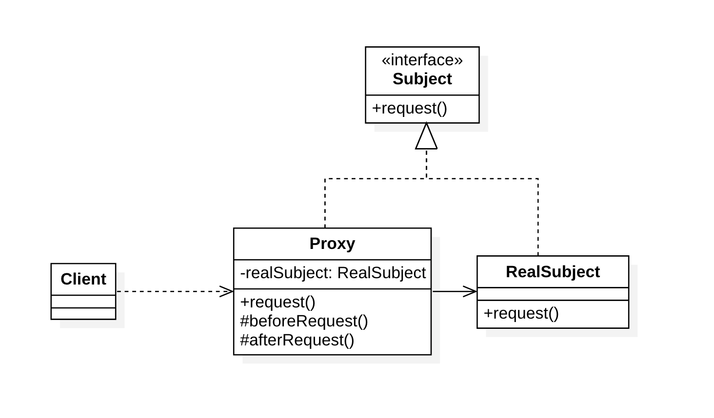
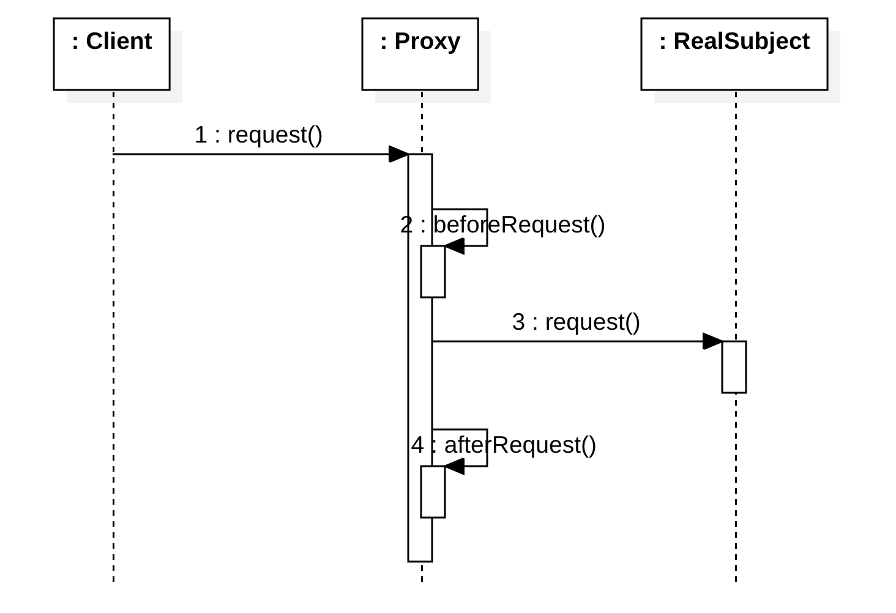

# 代理模式（Proxy Pattern）

## 定义

 意图：**为其他对象提供一种代理以控制对这个对象的访问**。

代理模式是一种**对象结构型模式**。

## 角色

- Subject（抽象对象）：定义一组业务逻辑的规范
- Proxy（代理对象）：作为真实对象的替代被客户端调用，将请求转发给真实对象进行处理，在请求转发前和请求执行后做一些额外的处理。
- RealSubject（ 真实对象）：实现业务逻辑

## 结构

## 优点

1. 能够协调调用者和被调用者，在一定程度上降低了系统的耦合度
2. 虚拟代理通过使用一个小对象来代表一个大对象，减少系统资源的消耗。

## 缺点

其缺点在于由于在客户端和真实对象之间增加了代理对象，因此有些类型的代理模式可能会造成请求的处理速度变慢，并且实现代理模式需要额外的工作，有些代理模式的实现非常复杂。

## 适用场景

- 远程(Remote)代理：为一个位于不同的地址空间的对象提供一个本地 的代理对象，这个不同的地址空间可以是在同一台主机中，也可是在 另一台主机中，远程代理又叫做大使(Ambassador)。
- 虚拟(Virtual)代理：如果需要创建一个资源消耗较大的对象，先创建一个消耗相对较小的对象来表示，真实对象只在需要时才会被真正创建。
- Copy-on-Write代理：它是虚拟代理的一种，把复制（克隆）操作延迟 到只有在客户端真正需要时才执行。一般来说，对象的深克隆是一个 开销较大的操作，Copy-on-Write代理可以让这个操作延迟，只有对象被用到的时候才被克隆。
- 保护(Protect or Access)代理：控制对一个对象的访问，可以给不同的用户提供不同级别的使用权限。
- 缓冲(Cache)代理：为某一个目标操作的结果提供临时的存储空间，以便多个客户端可以共享这些结果。
- 防火墙(Firewall)代理：保护目标不让恶意用户接近。
- 同步化(Synchronization)代理：使几个用户能够同时使用一个对象而没有冲突。
- 智能引用(Smart Reference)代理：当一个对象被引用时，提供一些额外的操作，如将此对象被调用的次数记录下来等。

## 应用案例

## 参考

- [代理模式](https://design-patterns.readthedocs.io/zh_CN/latest/structural_patterns/proxy.html#id16) - [图说设计模式](https://github.com/me115/design_patterns)
- [Proxy pattern](https://en.wikipedia.org/wiki/Proxy_pattern#UML_class_and_sequence_diagram) - WikiPedia

