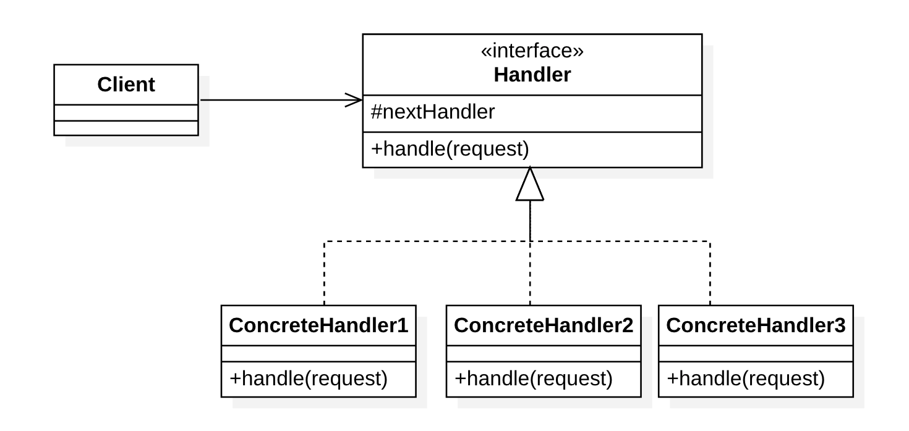
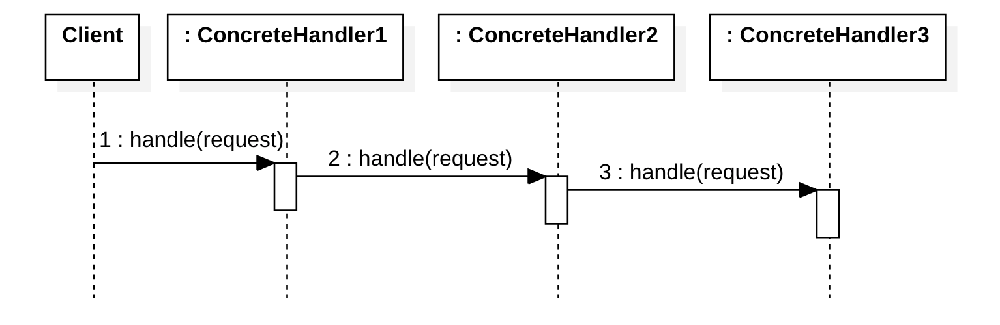

# 责任链模式（Chain of Responsibility Pattern）	

## 定义

意图：**通过给予多个对象处理请求的机会，以解除请求的发送者与接收者之间的耦合**。

责任链模式属于行为型模式。它包含了一些命令对象和一系列的处理对象。每一个处理对象决定它能处理哪些命令对象，它也知道如何将它不能处理的命令对象传递给该链中的下一个处理对象。该模式还描述了往该处理链的末尾添加新的处理对象的方法。因此，责任链是`if ... else if ... else if ......... else ... endif`的面向对象版本，其优点是条件语句块（condition–action blocks）可以在运行时动态地排列和配置。

## 结构

### 类图

### 时序图

### 角色

抽象处理者（Handler）：定义处理请求的接口

具体处理者（ConcreteHandler）：实现了处理者接口，由运行时条件来决定处理请求或转发请求给下一个处理者。

##与其他模式关联

责任链模式在结构上与装饰器模式几乎相同，区别在于装饰器的所有类都处理请求，而责任链中的一个类处理请求。这是GoF书中对“责任”概念的严格定义。但是，许多实现（例如日志记录器，UI事件处理或Java中的servlet过滤器等）都允许链中的多个类承担责任。

## 应用

### 适用场景

有多个对象可以处理同一个请求，具体哪个对象处理该请求待运行时刻再确定，客户端只需将请求提交到链上，而无须关心请求的处理对象是谁以及它是如何处理的

### 应用案例

- Tomcat 过滤器中的责任链模式
- Netty 中的 `Pipeline` 和 `ChannelHandler` 通过责任链设计模式来组织代码逻辑
- Spring Security 使用责任链模式，可以动态地添加或删除责任（处理 request 请求）
- Spring AOP 通过责任链模式来管理 Advisor
- Dubbo Filter 过滤器链也是用了责任链模式（链表），可以对方法调用做一些过滤处理，譬如超时(TimeoutFilter)，异常(ExceptionFilter)，Token(TokenFilter)等
- Mybatis 中的 Plugin 机制使用了责任链模式，配置各种官方或者自定义的 Plugin，与 Filter 类似，可以在执行 Sql 语句的时候做一些操作

## 参考

- [设计模式 | 责任链模式及典型应用](https://juejin.im/post/5bd95adfe51d45607e02ecc0) - 掘金
- 

