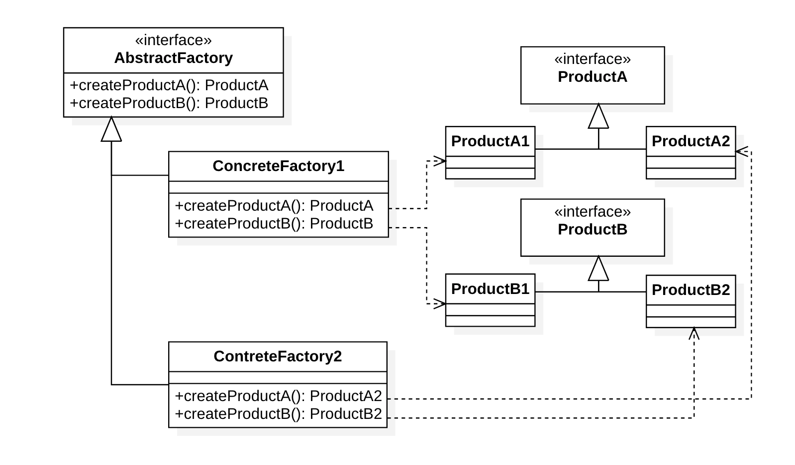

# 抽象工厂模式（Abstract factory pattern）

## 定义

抽象工厂模式属于创建型模式。抽象工厂模式提供了一种方式，可以将一组具有同一主题的单独的[工厂](https://zh.wikipedia.org/wiki/工厂方法)封装起来。在正常使用中，客户端程序需要创建抽象工厂的具体实现，然后使用抽象工厂作为[接口](https://zh.wikipedia.org/w/index.php?title=接口_(资讯科技)&action=edit&redlink=1)来创建这一主题的具体对象。客户端程序不需要知道（或关心）它从这些内部的工厂方法中获得对象的具体类型，因为客户端程序仅使用这些对象的通用接口。抽象工厂模式将一组对象的实现细节与他们的一般使用分离开来。

“工厂”是创建产品（对象）的地方，其目的是将产品的创建与产品的使用分离。抽象工厂模式的目的，是将若干抽象产品的接口与不同主题产品的具体实现分离开。这样就能在增加新的具体工厂的时候，不用修改引用抽象工厂的客户端代码。

## 意图

提供一个创建一系列相关或相互依赖的对象的接口，而无需指定这些对象的具体类。

## 优点

1. 具体产品的创建从客户端代码中分离出来
2. 容易改变产品的系列（具体工厂）

## 缺点

在产品族中扩展新的产品很困难的，它需要修改抽象工厂的接口。（产品族：具有相同抽象类的产品）

## 实现

## 应用案例

