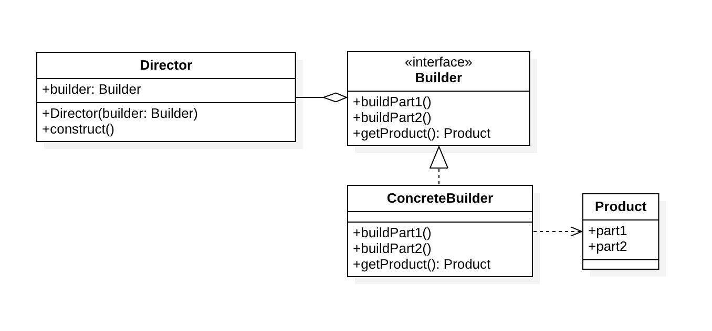
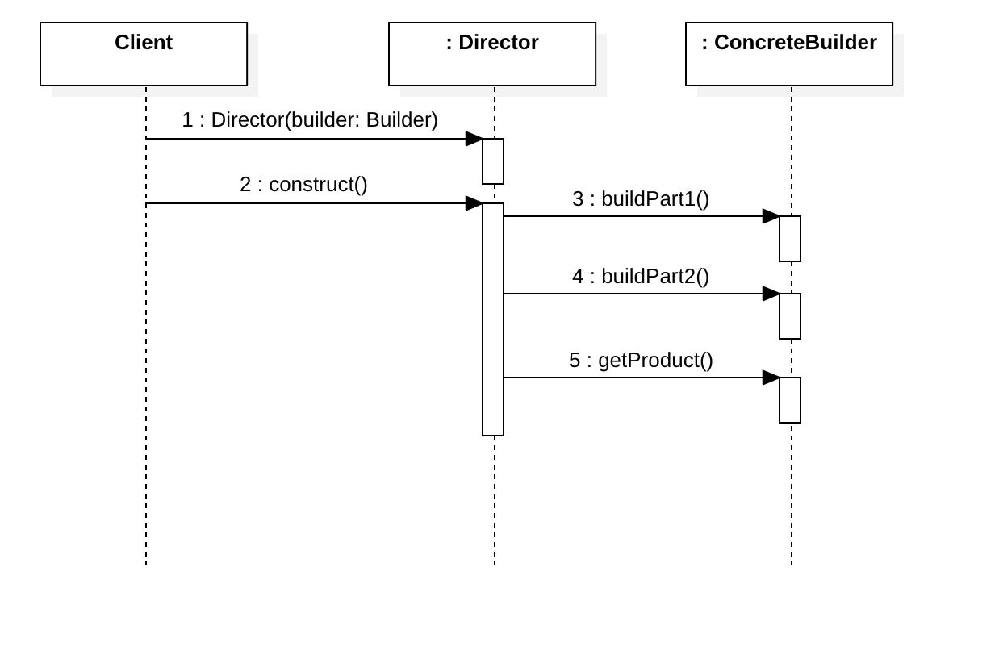

# 建造者模式（Builder Pattern）

[TOC]

## 定义

> The intent of the Builder design pattern is to separate the construction of a complex object from its representation. By doing so the same construction process can create different representations.

**将一个复杂的构建与其表示相分离，使得同样的构建过程可以创建不同的表示。**

建造者模式使用多个简单的对象逐步构建成一个复杂的对象，它允许用户只通过指定复杂对象的类型和内容就可以构建它们，用户不需要知道内部的具体构建细节。建造者模式属于创建型模式。

与工厂模式的区别是：建造者模式更加关注与零件装配的顺序。

## 结构

### 类图

### 时序图

### 角色

- **Director**: 指挥者，与客户端直接沟通，将建造产品任务委派给建造者。
- **Builder**: 抽象建造者，可以省略。
- **ConcreteBuilder**: 具体建造者，逐步组装部件，并返回最终产品。
- **Product**: 产品，供Client 消费的复杂对象。

## 优点

1.  建造者相对独立，客户端不必知道产品内部组成细节，可以很方便地替换建造者来建造不同的产品。**易于拓展**，符合“开闭原则“。

2. 将复杂产品的创建步骤分解在不同的方法中，使得创建过程更加清晰，也更方便使用程序来控制创建过程。**便于控制细节风险**。

## 缺点

1. 建造者模式所创建的产品一般具有较多的共同点，其组成部分相似，如果产品之间的差异性很大，则不适合使用建造者模式，因此其**使用范围受到一定的限制**。
2. 如产品内部变化复杂，可能会导致需要定义很多具体建造者类来实现这种变化，**会有很多的建造类**。

## 应用

静态内部类 Fluent建造者

JDK 中的 StringBuilder