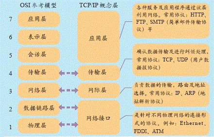
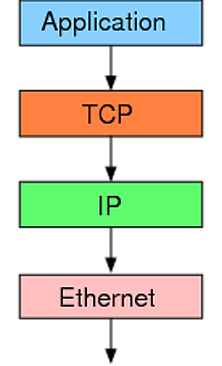
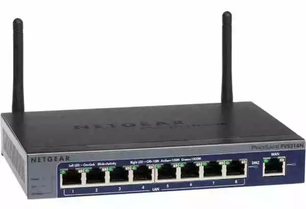

# 网络协议

## TCP协议

概念图

互联网由一整套协议构成。TCP 只是其中的一层，有着自己的分工。

最底层的以太网协议（Ethernet）规定了电子信号如何组成数据包（packet），解决了子网内部的点对点通信。

但是，以太网协议不能解决多个局域网如何互通，这由 IP 协议解决。

IP 协议定义了一套自己的地址规则，称为 IP 地址。它实现了路由功能，允许某个局域网的 A 主机，向另一个局域网的 B 主机发送消息。

TCP 协议只是一个地址协议，并不保证数据包的完整。如果路由器丢包（比如缓存满了，新进来的数据包就会丢失），就需要发现丢了哪一个包，以及如何重新发送这个包。这就要依靠 TCP 协议。

简单说，TCP 协议的作用是，保证数据通信的完整性和可靠性，防止丢包

### 参考

1. [五分钟带你读懂TCP协议（图文并茂）](https://mp.weixin.qq.com/s/rg3eKuO07TG3j5oFvP915A)

## Remote Produce Call (RPC)

### Remote Produce Call (RPC) 远程过程调用，是一种编程模型。

一个完整的RPC包含四个组件：客户端、客户端存根、服务端、服务端存根。

**客户端** 服务的调用方。

**客户端存根** 存放服务端的地址信息，将客户端的请求参数打包成网络消息、然后通过网络发送给服务方。

**服务端**  真正的服务提供者。

**服务端存根** 接收客户方发送过来的消息，将消息解包，并调用服务端。

解决问题：

1. **解决分布式系统中，服务之间的调用问题。**
2. **远程调用时，要能够像本地调用一样方便，让调用者感知不到远程调用的逻辑。**

### RPC服务和HTTP服务对比

RPC服务与具体协议无关，可基于TCP/HTTP协议，Web Service 就是基于 HTTP 协议的 RPC，它具有良好的跨平台性，但其性能却不如基于 TCP 协议的 RPC。

HTTP服务基于HTTP协议，HTTP属于应用层协议

## SSL协议

SSL（Secure Sockets Layer，安全套接层）是为网络通信提供安全及数据完整性的一种安全协议，SSL在网络传输层对网络连接进行加密。SSL 协议位于 TCP/IP 协议与应用层协议之间，为数据通信提供安全支持。SSL协议可分为两层：SSL 记录协议（SSL Record Protocol），它建立在可靠的传输协议（如TCP）之上，为高层协议提供数据封闭、压缩、加密等基本功能的支持。SSL 握手协议（SSL Handshake Protocol），它建立在 SSL 记录协议之上，用于在实际数据传输开始前，通信双方进行身份认证、协商加密算法、交换加密密钥等。在 Web 应用中是通过 HTTPS 来实现 SSL  的。

## 参考

https://www.cnblogs.com/sunsky303/p/10647255.html