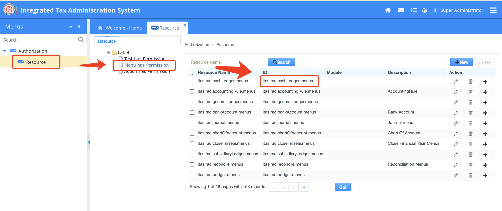
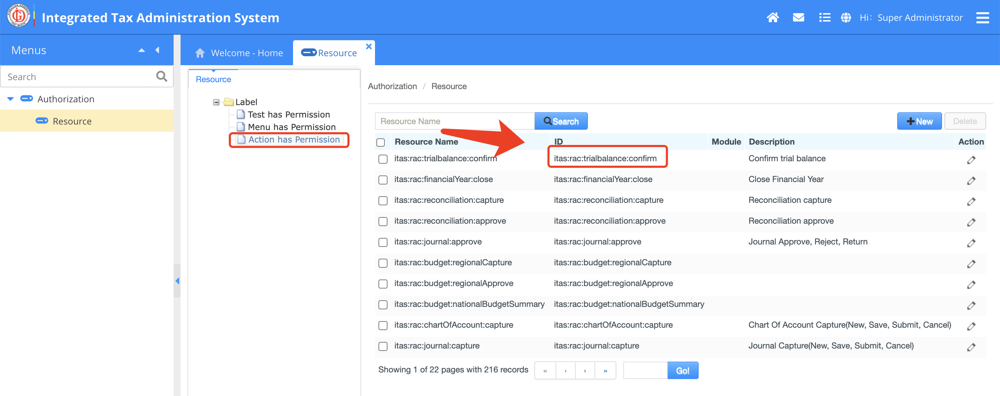

## 一、纵向越权问题

纵向越权指的是一个低级别攻击者尝试访问高级别用户的资源。其原理是由于Web应用仅仅在页面显示上做了权限控制，导致恶意用户只要猜测后端接口地址，就可以访问或高权限接口，达到权限提升的目的。

这种攻击很容易防御，只需要访问后端接口时进行权限验证即可。一个普通的权限系统，菜单是通过数据库中对应权限和角色来进行字符串拼接形成的，而不是静态的通过在页面上进行权限判断决定的。

### 菜单权限控制

**目标：**解决纵向越权问题。拥有菜单权限的用户，才可以访问对应的功能接口。

**整改范围：**(ITAS&ECM) 所有模块下的 Controller，包括 Apex 平台中的 Controller

**步骤：**

在类名定义处添加 Shiro 权限注解 `@RequiresPermissions("itas.ret.searchreturn.menus")`

```java
@Controller
@RequiresPermissions("itas.ret.searchreturn.menus")
@RequestMapping("/ret/return")
public class Tret02ReturnNewController extends ControllerBase {
  ...省略
}
```

`itas.ret.searchreturn.menus` 是菜单对应的权限 Key, 可以在 Resource 功能 `Menu has Permission`中找到



### 按钮/功能权限

**目标：**解决纵向越权问题。拥有功能权限的用户，才可以访问该功能接口。

**整改范围：**(ITAS&ECM) 所有模块下的 Controller，包括 Apex 平台中的 Controller

**步骤：**

在方法定义处添加 Shiro 权限注解 `@RequiresPermissions("itas:rac:reconciliation:approve")`

```java
    @RequiresPermissions("itas:rac:reconciliation:approve")
    @RequestMapping("/approveReconciliation.do")
    @ResponseBody
    @LogAnnotation(eventCode = "ApproveReconciliation", eventProcess = "approve bank statement reconciliation", type = "approve", entityStatus = "Approve")
    public String act_approveReconciliation(@ModelAttribute("entity") BankStatement entity) throws Exception {
        ... 省略
    }
```

`itas:rac:reconciliation:approve`是 按钮/功能对应的权限 Key, 可以在 Resource 功能 `Action has Permission`中找到。




## 二、横向越权限问题

横向越权指的是攻击者尝试访问其他组织/用户的资源（接口）。

为了避免以上横向越权的行为，需要在后端接口处理时校验用户的身份/所属组织。

1. 从 Session 中读取当前用户/组织 id；
2. 从数据库中当前操作数据所属用户/组织；
3. 如果不匹配，抛出未授权异常

示例代码：

```java
// 当前 office id
String curOrgId = UserUtil.getCurrentUser().getOrganizationId();   
// 业务数据归属的 office
BizEntity bizEntity =  bizService.get(String bizId);                         

//如不匹配，抛出异常
if(!StringUtils.equals(entity.getOrgId(),curOrgId){
    throw new UnauthorizedException("Unauthorized");
}

... 业务处理
```