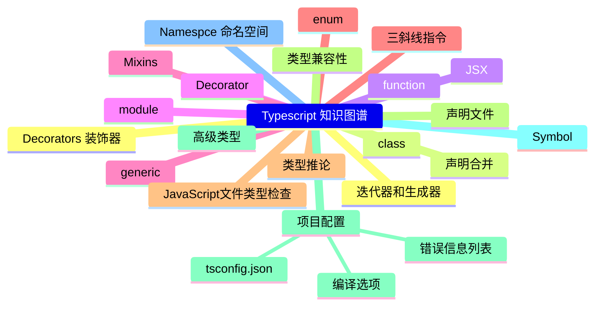

```mermaid
mindmap
Typescript 知识图谱
  Decorators 装饰器
  class
  function
  module
  generic
  enum
  类型推论
  类型兼容性
  高级类型
  Symbol
  Namespce 命名空间
  迭代器和生成器
  声明合并
  JSX
  Decorator 
  Mixins
  三斜线指令
  JavaScript文件类型检查
  声明文件
  项目配置
    tsconfig.json
    错误信息列表
    编译选项
```

### 