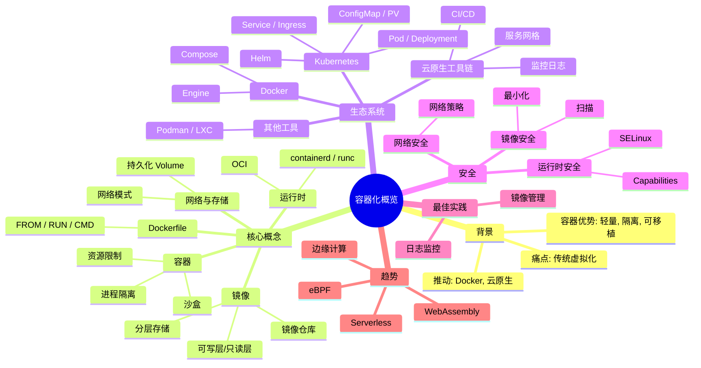

```mermaid
mindmap
  root((容器化概览))
    背景
      痛点: 传统虚拟化
      容器优势: 轻量, 隔离, 可移植
      推动: Docker, 云原生
    核心概念
      容器
        进程隔离
        资源限制
        沙盒
      镜像
        分层存储
        可写层/只读层
        镜像仓库
      Dockerfile
        FROM / RUN / CMD
      运行时
        OCI
        containerd / runc
      网络与存储
        网络模式
        持久化 Volume
    生态系统
      Docker
        Engine
        Compose
      Kubernetes
        Pod / Deployment
        Service / Ingress
        ConfigMap / PV
        Helm
      其他工具
        Podman / LXC
      云原生工具链
        CI/CD
        监控日志
        服务网格
    安全
      镜像安全
        扫描
        最小化
      运行时安全
        Capabilities
        SELinux
      网络安全
        网络策略
    最佳实践
      镜像管理
      日志监控
    趋势
      WebAssembly
      eBPF
      边缘计算
      Serverless

```

