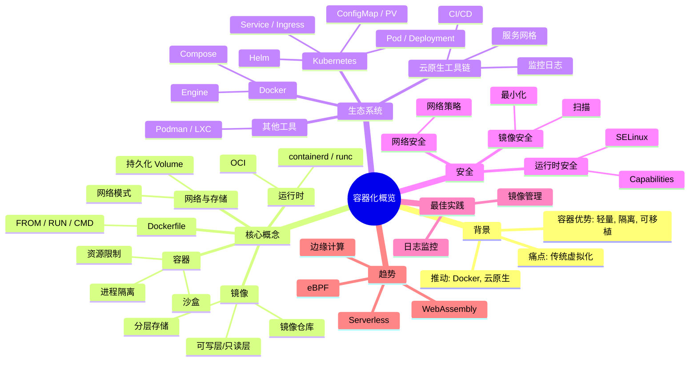

最初，项目构建和各环境部署都依赖于团队中经验丰富的成员手动操作。然而，即使是熟练的工程师也难以避免因不完全了解代码变更范围、遗漏修改配置文件等失误，导致需要重复执行打包和部署流程，这使得版本发布成为一项繁重且容易出错的工作。

CI/CD 是持续集成（Continuous Integration） 和 持续交付（Continuous Delivery）的英文缩写 ，它是一种软件开发方法，旨在持续的构建、测试、部署和监控代码变更。 简单来说，当提交代码时 CI/CD 系统会自动化构建项目、运行测试，并在测试通过后部署到测试环境甚至生产环境。 以确保每次代码提交都能快速验证，并及时发现和修复问题。
