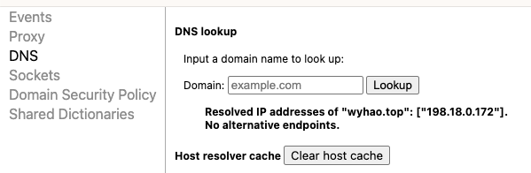
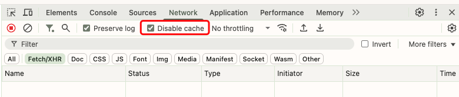

## 自建 Github 代理方法

方法参考项目： https://github.com/hunshcn/gh-proxy

GitHub 加速网站：

* https://hub.fastgit.org/

### 解决 GitHub+Pages使用过域名解析，停止后还能跳转到原有地址的问题

1. **检查DNS解析：**

   浏览器地址栏输入：chrome://net-internals/#dns，填入github-pages地址，发现没有解析到其他域名。

2. **检查浏览器缓存**

   排队了DNS解析问题，再检查一下是否浏览器缓存导致。切换到隐身模式（File > New Incognito windows)后，填入github-pages地址，没有跳转旧域名，可以确定就是浏览器缓存导致。

3. **禁用浏览器缓存**：

   在浏览器的新标签页，按F12打开开发者工具，切换到 Network（网络），勾选Disable cache（禁用缓存）。

​	之后，在浏览器中输入你的Pages网址：`example.github.io`，会发现浏览器不再跳转旧域名了，问题解决了！

