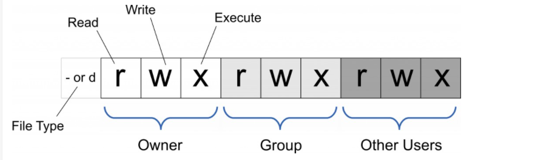

# Linux文件权限说明

### 查看文件的权限

**查看命令**ls -l：表示查看当前目录下所有文件夹和文件的权限。

```
$ ls -lh
total 36K
drwxr-xr-x 2 user user 4.0K  4月 16 14:39 Desktop
drwxr-xr-x 3 user user 4.0K  4月 12 13:57 Documents
drwxr-xr-x 2 user user 4.0K  4月 16 18:52 Downloads
drwxr-xr-x 2 user user 4.0K  4月 11 23:24 Music
drwxr-xr-x 2 user user 4.0K  4月 11 23:24 Pictures
drwxr-xr-x 2 user user 4.0K  4月 11 23:24 Public
drwx------ 5 user user 4.0K  4月 12 11:28 snap
drwxr-xr-x 2 user user 4.0K  4月 11 23:24 Templates
drwx------ 1 user user    0  5月 10 11:57 thinclient_drives
drwxr-xr-x 3 user user 4.0K  4月 12 13:57 Videos
```


**权限组成说明**



以drwxr-xr-x为例进行说明，一共有十位数。

第1个参数：文件是-，文件夹是d。

第 2-4 参数：代表的是所有者（Owner）拥有的权限。

第 5-7 参数：代表的是组群（Group）拥有的权限。

第8到10参数：代表的是其他人（Other）拥有的权限。

d：文件是-，文件夹是d。

r 表示文件可以被读（read）。

w 表示文件可以被写（write）。

x 表示文件可以被执行（如果它是程序的话）。

\- 表示相应的权限还没有被授予。

之后的root root 就是用户拥有者了。


**实例说明**

drwxr-xr-x=755 表示目录的操作权限，root 用户有读、写、执行权限，root 用户组有读、执行权限，其他所有用户有读、执行权限。

-rw-r--r--=644 表示文件的操作权限，root 用户有读、写权限，root 用户组有读权限，其他所有用户有读权限。


### 修改权限

1）命令行输入：chmod o+w xxx.xxx

表示给其他人授予写xxx.xxx这个文件的权限

2）命令行输入：chmod go-rw xxx.xxx

表示删除xxx.xxx中组群和其他人的读和写的权限


#### 2.2.2 详细说明

u 代表所有者（user）。

g 代表所有者所在的组群（group）。

o 代表其他人，但不是u和g （other）。

a 代表全部的人，也就是包括u，g和o。

r 表示文件可以被读（read）。

w 表示文件可以被写（write）。

x 表示文件可以被执行（如果它是程序的话）。

其中：rwx 也可以用数字来代替

r ------------4

w -----------2

x ------------1

\- ------------0

**操作：**

+：表示添加权限

\- ：表示删除权限

=：表示使之成为唯一的权限

**常见的以下的一些权限解释：**

-rw------- (600) 只有所有者才有读和写的权限。

-rw-r--r-- (644) 只有所有者才有读和写的权限，组群和其他人只有读的权限。

-rwx------ (700) 只有所有者才有读，写，执行的权限。

-rwxr-xr-x (755) 只有所有者才有读，写，执行的权限，组群和其他人只有读和执行的权限。

-rwx--x--x (711) 只有所有者才有读，写，执行的权限，组群和其他人只有执行的权限。

-rw-rw-rw- (666) 每个人都有读写的权限。

-rwxrwxrwx (777) 每个人都有读写和执行的权限。